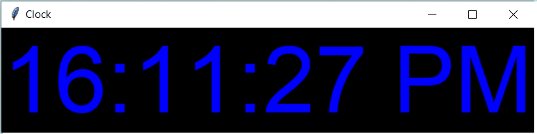

# DigitalClock-Using-Python
Code to create a clock using Python
# How to run
```
$-> git clone https://github.com/Yash-07C/DigitalClock-Using-Python.git
$-> cd DigitalClock-Using-Python
$ DigitalClock-Using-Python -> python main.py
```
# Output

